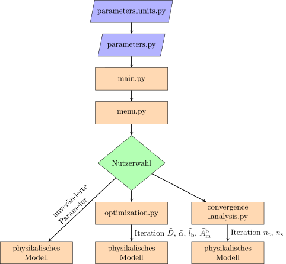
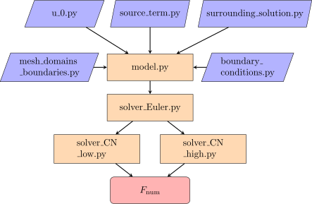
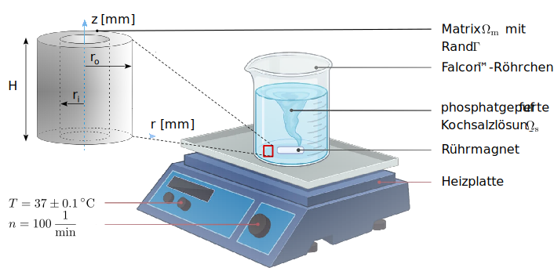
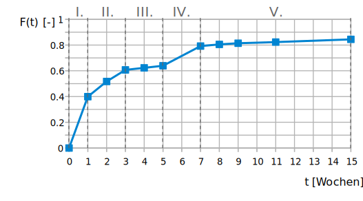

# Simulation der diffusionsbedingten Medikamentenfreisetzung aus Nanopharmazeutika auf Polymerbasis unter Berücksichtigung der Matrixdegradation

Dieser <a href="https://github.com/jan-pieter-engineering/Drug-Delivery-From-Nanopharmaceuticals/blob/master/thesis/thesis.pdf" style="color: red; text-decoration: underline;text-decoration-style: dotted; font-weight:bold;">Arbeit</a> liegt ein [Experiment](#Experiment) zugrunde, das die [Freisetzungskurve](https://de.wikipedia.org/wiki/Pharmakokinetik) des Wirkstoffs [Gentamicin](https://de.wikipedia.org/wiki/Gentamicin) (GM), der
in eine [Medikamentenmatrix](https://de.wikipedia.org/wiki/Pharmazeutischer_Hilfsstoff) eingebettet wurde, bestimmt.
Dazu wurde ein [Python3-Quelltext](./) entwickelt, der mit Hilfe von [FEniCS Legacy](https://fenicsproject.org/download/archive/) das 15-wöchige Experiment innerhalb ca. einer halben Stunde mit einem Bestimmtheitsmaß von $\Re_{0, \, 10}^2 \approx 0.9899$ voraussagen kann.

Die Simulation lässt sich durch folgende Konsoleneingabe starten:  
``python3 main.py ``
## Programmablaufpläne

### Quelltext

Untenstehende Abbildung 1 illustriert den Ablauf des Python-Quelltexts. In [paramaters_units.py](./parameters_units.py) sind die Material- und Geometrieparameter in einheitenbehafteter Darstellung sowie die Referenzparameter zur Überführung dieser in die einheitenlose Form hinterlegt.

<figure>
  
  <figcaption>Abb. 1: Programmablaufplan des Quelltexts.</figcaption>
</figure>

Diese einheitenlosen Parameter werden in [parameters.py](./parameters.py), neben weiteren Hilfsparametern, gespeichert und zusammen an [main.py](./main.py) übergeben. Dort kann der Nutzer folgende Menuwahl (siehe [menu.py](https://github.com/jan-pieter-engineering/Drug-Delivery-From-Nanopharmaceuticals/blob/master/menu.py)) treffen: 
1. Simulation des physikalischen Modells (vgl. Kapitel [5.2](./thesis/thesis.pdf#Zeitliche Diskretisierung))
2. Inverse Analyse (vgl. Kapitel [5.7](./thesis/thesis.pdf#Inverse Analyse))
3. Konvergenzanalyse (vgl. Kapitel [5.4](./thesis/thesis.pdf#Konvergenzanalyse))

Im Fall einer Simulation des physikalischen Modells wird an [model.py](./model.py) übergeben. Wählt der Nutzer eine Konvergenzanalyse, greift Quelltext [convergence_analysis.py](https://github.com/jan-pieter-engineering/Drug-Delivery-From-Nanopharmaceuticals/blob/master/convergence_analysis.py). Hier kann zwischen einer Optimierung für den Diffusionskoeffizenten $\tilde{D}$, des Stoffübergangsparameters $\tilde{\alpha}$ und des Längenparameters $\tilde{l}_\mathrm{b}$ während der ersten fünf Wochen oder einer Optimierung für die Matrixoberfläche nach dem Bruch $\tilde{A}_\mathrm{m}^\mathrm{b}$ während der weiteren zehn Wochen gewählt werden. Diese Parameter werden iteriert und jeweils zur erneuten Berechnung an \emph{model.py} übergeben. Möchte der Nutzer eine Konvergenzanalyse ausführen, wird für eine zeitliche Konvergenzanalyse die Anzahl der Zeitschritte $n_\mathrm{t}$ iteriert, für eine räumliche Konvergenzanalyse analog die Anzahl der Elemente $n_\mathrm{s}$ und jeweils an [model.py](https://github.com/jan-pieter-engineering/Drug-Delivery-From-Nanopharmaceuticals/blob/master/model.py) übergeben.

### Physikalisches Modell

Alle [oben genannten](#Quelltext) Programmabläufe verwenden das *physikalische Modell*. Abbildung 2 verdeutlicht daher den Aufbau der Implementierung des in dieser Arbeit präsentierten physikalischen Modells, siehe Kapitel [5.2](<A HREF="https://github.com/jan-pieter-engineering/Drug-Delivery-From-Nanopharmaceuticals/blob/master/thesis/thesis.pdf#Zeitliche Diskretisierung">) und [5.3](<A HREF="https://github.com/jan-pieter-engineering/Drug-Delivery-From-Nanopharmaceuticals/blob/master/thesis/thesis.pdf#Räumliche Diskretisierung">).

<figure>
  
  <figcaption>Abb. 2: Programmablaufplan der Implementierung des räumlich und zeitlich diskretisierten physikalischen Modells.</figcaption>
</figure>

Im Zentrum steht der Quelltext [model.py](./model.py). Darüber hinaus findet sich die Implementierung der konstanten bzw. parabelförmigen Startkonzentrationsverteilung $\tilde{c} \left ( \tilde{r}, \tilde{t}=0 \right)$ (vgl. Kapitel [3.2.2](./thesis/thesis.pdf#Wirkstoffverteilung innerhalb der Matrix) in einheitenbehafteter Darstellung) in [u_0.py](./u_0.py). Die Implementierung der \textsc{Robin}-Randbedingung (vgl. Kapitel [5.2.3](./thesis/thesis.pdf#Zeitliche_Diskretisierung_Randbedingungen) und [5.2.4](./thesis/thesis.pdf#Zeitliche_Diskretisierung_Stoffübergangskoeffizient)) ist im Quelltext [boundary_conditions.py](./boundary_conditions.py) hinterlegt, die der Diffusionsgleichung der Umgebungslösung (vgl. Kapitel [5.2.5](./thesis/thesis.pdf#Zeitliche_Diskretisierung_Diffusionsgleichung_der_Umgebungslösung)) im Quelltext [surrounding_solution.py](./surrounding_solution.py). In [mesh_domains_boundaries.py](./mesh_domains_boundaries.py) findet sich die Implementierung der räumlichen Diskretisierung der hohlzylinderförmigen Medikamentenmatrix $\tilde{\Omega}_\mathrm{m}$ (vgl. Kapitel [5.3.1](./thesis/thesis.pdf#Räumliche_Diskretisierung)). Im Falle der Konvergenzanalyse (vgl. Kapitel [5.4](./thesis/thesis.pdf#Konvergenzanalyse) wird ein Quellterm aus [source_term.py](./source_term.py) zugeschaltet. Ansonsten ist dieser Wert, entsprechend einer homogenen Diffusionsgleichung, null.  
[model.py](./model.py) bekommt [u_0.py](./u_0.py), [source_term.py](./source_term.py), [surrounding_solution.py](./surrounding_solution.py), [mesh_domains_boundaries.py](./mesh_domains_boundaries.py), [boundary_conditions.py](./boundary_conditions.py) und den aus Übersichtsgründen nicht dargestellten Quelltext [degradation.py](./degradation.py) (vgl. Kapitel [5.2.2](./thesis/thesis.pdf#Zeitliche_Diskretisierung_Degradationsmodell)) als Input übergeben.  
Daraufhin wird die homogene Diffusionsgleichung (vgl. Kapitel [5.2.1](./thesis/thesis.pdf#Zeitliche_Diskretisierung_Homogene_Diffusionsgleichung}) mit Hilfe von [solver_Euler.py](./solver_Euler.py) für $n_\mathrm{t} = 100$ Zeitschritte berechnet. Nach Ablauf dieser Zeitschritte wird die homogene Diffusionsgleichung durch ein adaptives Crank-Nicolson-Verfahren (vgl. Kapitel [5.2](./thesis/thesis.pdf#Zeitliche_Diskretisierung)) berechnet. Dazu werden [solver_CN_low.py](./solver_CN_low.py) und [solver_CN_high.py](./solver_CN_high.py) verwendet.  
Als Output gibt [model.py](./model.py) die numerisch bestimmte Freisetzungskurve $F_\mathrm{num}$ (vgl. Gleichung [5.3.1](./thesis/thesis.pdf#Zeitliche_Diskretisierung_Freisetzungskurve)) zurück. Sie wird mit Hilfe der in [utility.py](./utility.py) implementierten Funktion [calc_F()](./utility.py#:~:text=calc_F) berechnet.

## Experiment

An dieser Stelle wird das von [Macha et al., [2019](https://doi.org/10.3389/fbioe.2019.00037)] durchgeführte Experiment zur Bestimmung der Freisetzungskurve des Wirkstoffs Gentamicin (GM), der in eine Medikamentenmatrix eingebettet wurde, kurz vorgestellt.  
GM diffundiert während des Experiments aus der Medikamentenmatrix $\Omega_\mathrm{m}$ in die matrixumgebende Lösung $\Omega_\mathrm{s}$ hinein. In der Umgebungslösung $\Omega_\mathrm{s}$ wird die Konzentration von GM in wöchentlichen Abständen mit Hilfe eines UV/Vis-Spektralphotometers gemessen. 

<figure>
  
  <figcaption>Abb. 3: Versuchsaufbau: Mit $10 \, \%$ GM-Massenanteil versehene, biokompatible, biologisch abbaubare, nanoporöse, hohlzylinderförmige ($r_\mathrm{o} = 3.4 \, \mathrm{mm}$, $r_\mathrm{i} = 3.2 \, \mathrm{mm}$, $H = 20 \, \mathrm{mm}$) PLA-Matrix $\Omega_\mathrm{m}$ in Umgebungslösung $\Omega_\mathrm{s}$ ($V_\mathrm{s} = 1.5 \times 10^4 \, \mathrm{mm^3}$, $\mathit{pH} = 7.4$, $T = 37\pm 0.1 \, ^{\circ} \mathrm{C}$) auf Magnetrührer bei $n = 100 \, \frac{1}{\mathrm{min}}$ Umdrehungen. [Macha et al., [2019](https://doi.org/10.3389/fbioe.2019.00037), [MicrobeNotes](https://microbenotes.com/magnetic-stirrer-principle-parts-types-uses-examples/)</figcaption>
</figure>

Die Medikamentenmatrix $\Omega_\mathrm{m}$ ist eine aus Polylactid (PLA) gefertigte, biokompatible, biologisch abbaubare, nanoporöse Matrix, welche in Streifen geschnitten und gerollt wird. Daraus resultiert ein Hohlzylinder mit einem Außenradius von $r_\mathrm{o} = 3.4 \, \mathrm{mm}$, einem Innenradius von $r_\mathrm{i} = 3.2 \, \mathrm{mm}$ und einer Höhe von $H = 20 \, \mathrm{mm}$, siehe Abbildung 3. Diese gerollten Streifen, die zuvor mit einem GM-Massenanteil von 10 \% versehen wurden, werden zusammen mit der Umgebungslösung $\Omega_\mathrm{s}$ in ein konisches Falcon\textsuperscript{TM}-Röhrchen gegeben. Als Umgebungslösung $\Omega_\mathrm{s}$, welche physikalische Eigenschaften ähnlich denen von Körperflüssigkeiten inne hat, wird phosphatgepufferte Kochsalzlösung verwendet. Die Lösung hatte ein Volumen von $V_\mathrm{s} = 1.5 \times 10^4 \, \mathrm{mm^3}$, einen $\mathit{pH}$-Wert von $\mathit{pH} = 7.4$, wird über das Experiment hinweg auf Körpertemperatur ($T = 37\pm 0.1 \, ^{\circ} \mathrm{C}$) gehalten und mit Hilfe eines Magnetrührers bei $n = 100 \, \frac{1}{\mathrm{min}}$ Umdrehungen gerührt.  

Durch dieses Experiments wurde die Freisetzung $F \left ( t \right ) \, \mathrm{\left [ - \right ]}$ von GM bestimmt, welche nach

$F \left ( t \right ) = \frac{ c_\mathrm{s} \left ( t \right ) }{c_\mathrm{max}}, \quad 0 \leq F \left ( t \right ) \leq 1 \ ,$

definiert ist. $c_\mathrm{s} \left ( t \right) \, \mathrm{\left [ \frac{g}{mm^3} \right ]}$ beschreibt die Konzentration von GM, die in der Umgebungslösung zum Zeitpunkt $t \, \mathrm{\left [ s \right ]}$ gemessen wird und $c_\mathrm{max} \, \mathrm{\left [ \frac{g}{mm^3} \right ]}$ die höchstmögliche Konzentration des Wirkstoffs in ebendieser.  
Aus der per UV/Vis-Spektralphotometer gemessenen Konzentration $c_\mathrm{s} \left ( t \right )$ von GM in der Umgebungslösung und deren maximal mögliche Konzentration $c_\mathrm{max}$ resultiert die Freisetzungskurve $F \left ( t \right)$ von GM, siehe Abbildung 4. Zwischen den gemessenen Datenpunkten wird linear interpoliert.

<figure>
  
  <figcaption>Abb. 4: GM-Freisetzungsverlauf $F \left ( t \right) \, \mathrm{\left [ - \right ]}$ über 15 Wochen. Blaue Rechtecke beschreiben die gemessenen Konzentrationswerte. Dazwischen wurde linear interpoliert.</figcaption>
</figure>

## Zusammenfassung

Im Rahmen der [Arbeit](./thesis/thesis.pdf) wird ein [computergestützes Modell](./) (in silico) präsentiert, dass das entsprechende [Reagenzglas-Experiment](#Experiment) (in vitro) mit einem Bestimmtheitsmaß von $\Re_{0, 10}^2 \approx 0.9899$ prädiktiert. Dazu wird auf Basis von [Macha et al., [2019](https://doi.org/10.3389/fbioe.2019.00037)] ein Modell präsentiert, dass die zugrunde liegenden physikalischen Prozesse der Wirkstofffreisetzung und Matrixdegradation beschreibt und erklärt. Das vierstufige Modell von [Macha et al., [2019](https://doi.org/10.3389/fbioe.2019.00037)] wird um eine weitere Stufe - den Matrixbruch - erweitert. So lässt sich die Wirkstofffreisetzung über die 15-wöchige  Versuchsdauer hinweg durch folgende Stufen beschreiben: 

- I. Stoßartige Freisetzung (1. Woche)
- II. Geminderte Freisetzung (2. - 3. Woche)
- III. Stagnation (4. - 5. Woche)
- IV. Matrixbruch (6. - 7. Woche)
- V. Restfreisetzung (8. - 15. Woche)

Zunächst wird der Einfluss der Wirkstoffpartikel, die sich zu Beginn auf der Matrixoberfläche befinden, auf die stoßartige Freisetzung während der ersten Woche untersucht und als vernachlässigbar eingestuft. Ebenfalls wird der Einfluss einer konstanten bzw. parabelförmigen Wirkstoffverteilung über den Matrixquerschnitt betrachtet. Dass eine parabelförmige Wirkstoffverteilung die stoßartige Wirkstofffreisetzung während der ersten Woche durch die hohe Wirkstoffkonzentration im randnahen Bereich besser prädikiert, bestätigt sich nicht. Die bereits in der Literatur vorzufindende Annahme einer konstanten Wirkstoffverteilung wird für weitere Untersuchungen empfohlen. Darüber hinaus wird die von [Macha et al., [2019](https://doi.org/10.3389/fbioe.2019.00037)] vorgestellte Robin-Randbedingung um einen weiteren Fall ergänzt. Neben dem Sättigungsfall, der die Modellierung der geminderten und darauffolgenden stagnierenden Wirkstofffreisetzung ermöglicht, wird die Randbedigung um den Fall des Matrixbruchs ergänzt. Dabei wird zum Zeitpunkt des Matrixbruchs der Materialtransferkoeffizient der Robin-Randbedingung schlagartig erhöht. Dazu wird ein Matrixdegradationsmodell entworfen, dass den Zerfall der Matrix in Abhängigkeit von der Wirkstoffkonzentration innerhalb der Matrix modelliert. Je mehr Wirkstoff aus der Matrix herausdiffuniert, um so höher ist die Matrixdegradation. Das Modell prognostiziert den Zeitpunkt der stark ansteigenden Wirkstofffreisetzung erfolgreich, jedoch wird die vorherige Stagnation zwischen der vierten und fünften unterprädiktiert.  
Die oben genannten Abläufe werden zu einem Gesamtmodell zusammengefasst und mit Hilfe der Finiten-Elemente-Methode durch das Programm FEniCS Legacy berechnet. Dazu wird das Modell, basierend auf der allgemeinen Diffusionsgleichung, in die schwache Form überführt und zeitlich sowie räumlich diskretisiert. Die zeitliche Diskretisierung erfolgt mit Hilfe eines adaptiven Crank-Nicolson-Verfahrens. Für die ersten Zeitschritte wird zusätzlich die explizite Euler-Methode implementiert, um Schwingungen der Lösung aufgrund der Unstetigkeit zwischen Randbedingung und Startbedingung zu vermeiden. Die Symmetrien der zylinderförmigen Matrix werden genutzt, wodurch die räumliche Disrektisierung durch eindimensionale Linienelemente über den Matrixradius verwirklicht werden kann. Daraufhin wird die zeitliche und räumliche Diskretisierung mit Hilfe der *Method of Manufactured Solutions*, dem diesbezüglichen Goldstandard, überprüft.  
Abschließend wird eine inverse Analyse durchgeführt, womit sich der Diffusionskoeffizient des Wirkstoffs, der Stoffübergangskoeffizient, die kritische Matrixdegradation, die zum Bruch führt, eine für die Degradation spezifische Konstante und die durch den Bruch erhöhte Matrixoberfläche bestimmen lässt. Durch Implementierung dieser Parameter in das hier vorgestellte Modell, lässt sich die Wirkstofffreisetzungskurve des 15-wöchigen Experiments innerhalb von ca. 37 Minuten berechnen. So lassen sich eine Vielzahl zusätzlicher Matrixdesigns und Wirkstoffmassen berechnen ohne die Zeit und Personalkosten der jeweiligen Experimente in Kauf nehmen zu müssen. Auch ist es denkbar, technisch noch nicht umsetzbare Matrixdesigns zu simulieren und so deren Vorteilhaftigkeit offenzulegen. Auf diese Weise kann die präklinische Phase, in der solche in vitro-Experimente klassischerweise durchgeführt werden, zeitlich verkürzt, kostentechnisch optimiert und die Zulassungchancen des neuen Medikamentes erhöht werden. Die Dringlichkeit dieser Aspekte wurde der Gesellschaft nicht zuletzt durch den Coronavirus SARS-CoV-2 vor Augen geführt.  
Ansatzpunkte für weiterführende Arbeiten sind die zu hoch vorausgesagte Wirkstofffreisetzung während der Stagnationphase und eine Überarbeitung des Degradationsmodells, da das hier vorgestellte keine tieferliegenden Degradationsphänomene berücksichtigt. Im Rahmen dieser Arbeit wurden zwar Degradationsmodelle, die die Oberfläche der Wirkstoffpartikel bzw. die der Hohlräume innerhalb der nanoporösen Matrix miteinbeziehen, entwickelt, jedoch aufgrund der Komplexität, die aus der entsprechenden Überführung in die Kontinuumsumgebung resultiert, auf deren Implementierung verzichtet. Darüber hinaus ist eine durch Hydrolyse modellierte Matrixdegradation ein vielversprechender Ansatzpunkt zur Entwicklung eines Modells, das die  tieferliegenden Degradationsprozesse berücksichtigt. Bezüglich der überprognostizierten Wirkstofffreisetzung während der Stagnationsphase ist ein an die Degradation gekoppelter und somit ortsabhängiger Diffusionskoeffizient und eine überarbeitete Randbedingung angedacht.

