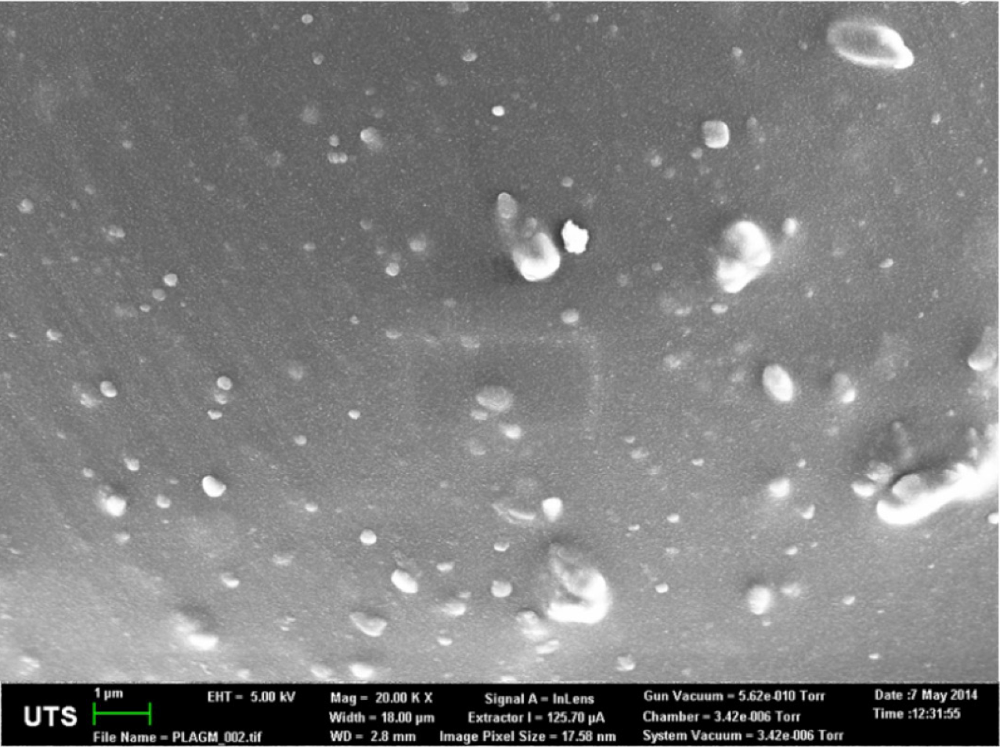

Im Rahmen dieser [Arbeit](../thesis/thesis.pdf) wurde die Gentamicin-Masse $m\_{\mathrm{d}, \Gamma}$ , die sich auf der Matrixoberfläche $\Gamma$ befindet, mit Hilfe eines [Octave-Programmes](./drug_mass_on_matrix_surface.m) bestimmt. Dazu wurde die Gentamicin-Masse $m\_{\mathrm{d, REM}}$ auf einer REM-Aufnahme der Matrixoberfläche $\Gamma\_{\mathrm{REM}}$ berechnet und auf die gesamte Matrixoberfläche $\Gamma$ hochgerechnet. Abbildung 1 zeigt die REM-Aufnahme der Matrixoberfläche. Die helleren Bereiche sind Gentamicin-Partikel.  

<figure>
  
  <figcaption>Abb. 1: REM-Aufnahme der Oberfläche einer mit GM besetzten PLA-Matrix. Die helleren Bereiche sind GM-Partikel.    
  </figcaption> 
</figure> 

Der [Quellcode](./drug_mass_on_matrix_surface.m) teilt sich dabei in vier Bereiche auf:

- I. Konvertierung der REM-Aufnahme in eine Schwarz-Weiß-Aufnahme (ab Zeile [10](./drug_mass_on_matrix_surface.m#L10))
- II. Bestimmung der REM-Fläche (ab Zeile [34](./drug_mass_on_matrix_surface.m#L34))
- III. Bestimmung der Wirkstoffpartikelgeometrie (ab Zeile [60](./drug_mass_on_matrix_surface.m#L60))
- IV. Bestimmung der Wirkstoffmasse (ab Zeile [91](./drug_mass_on_matrix_surface.m#L91))

Die entsprechenden Ergebnisse werden analog in Kapitel [3.2.1](../thesis/thesis.pdf#Oberfläche) aufbereitet.
